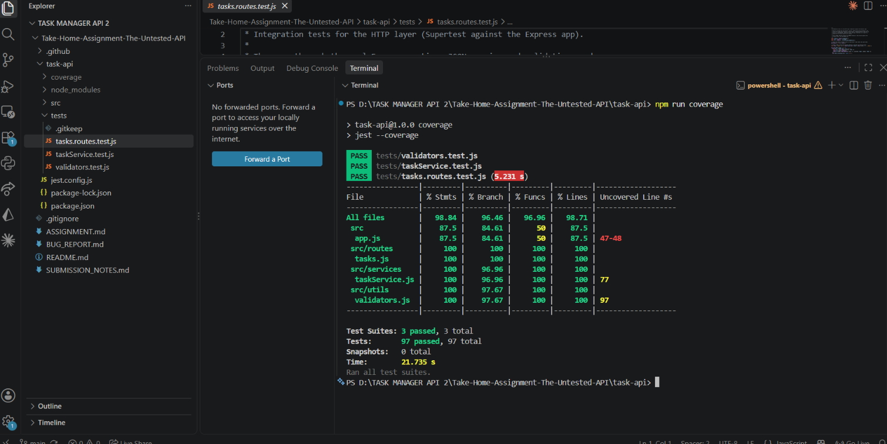

# Submission Notes

## What was done
| Part | Where |
|---|---|
| Tests (unit + integration) | `task-api/tests/` (97 tests) |
| Coverage | see below (98.84% statements) |
| Bug report | `BUG_REPORT.md` (11 bugs + smaller issues; **9 fixed**) |
| Fixes | `taskService.js`, `routes/tasks.js`, `validators.js`, `app.js` (each fix is commented with `FIX (Bug #n)`) |
| New endpoint | `PATCH /tasks/:id/assign` |
| CI | `.github/workflows/ci.yml` runs the tests + coverage on Node 18 and 20 for every push |

## Coverage (`npm run coverage`)

## `PATCH /tasks/:id/assign` design decisions
- **Empty / whitespace-only / non-string / missing assignee -> 400.** A blank string is not a person; silently accepting it would make "unassigned" ambiguous (`null` vs `""`).
- **Names are trimmed** before storing, so `"  Bob "` and `"Bob"` are the same person.
- **Max length 100** to stop huge payloads being stored.
- **Unknown task -> 404.**
- **Already assigned -> allowed, overwrites (200).** Reassignment/handover is a normal workflow and it keeps the endpoint idempotent. If the product needs it, this could become `409` or require an explicit `force` flag.
- New tasks now have `assignee: null` so the task shape is consistent.
- Body is validated *before* the task lookup (400 wins over 404 for a malformed body).
- Tradeoff: `assignee` is a free-text name, not a user id, as specified. There's no way to guarantee "Alice" and "alice" are the same person.

## What I'd test next
- Concurrency/ordering behavior once a real DB replaces the in-memory array.
- `PUT` semantics (it behaves like a partial update, not a true full replace).
- The remaining documented issues (Bug 9: falsy values skipping validation; `description` validation; a 400 for unknown `?status=` values; a cap on `limit`).
- Very large payloads and timezone handling for date-only due dates.

## What surprised me
- The brief and README list different status values (`todo/in_progress/done` vs `pending/in-progress/completed`); the code uses the former, so tests follow the code.
- `completeTask` silently changing priority looked deliberate at first glance but has no justification in the spec.
- The error handler swallows the status of framework errors (bug 7).
- My first fix for `PUT` only blocked `id`/`createdAt`; re-reviewing showed `PUT` could also set an unvalidated `assignee` and forge `completedAt`, so I replaced it with an allow-list (bug 4).

## Questions before production
- Should `completedAt` be derived from status automatically?
- Is `PUT` meant to be a full replacement or a partial update?
- Auth/ownership: who may assign, and should `assignee` reference real users?
- Persistence, pagination response shape (total count / metadata), rate limiting, logging.
